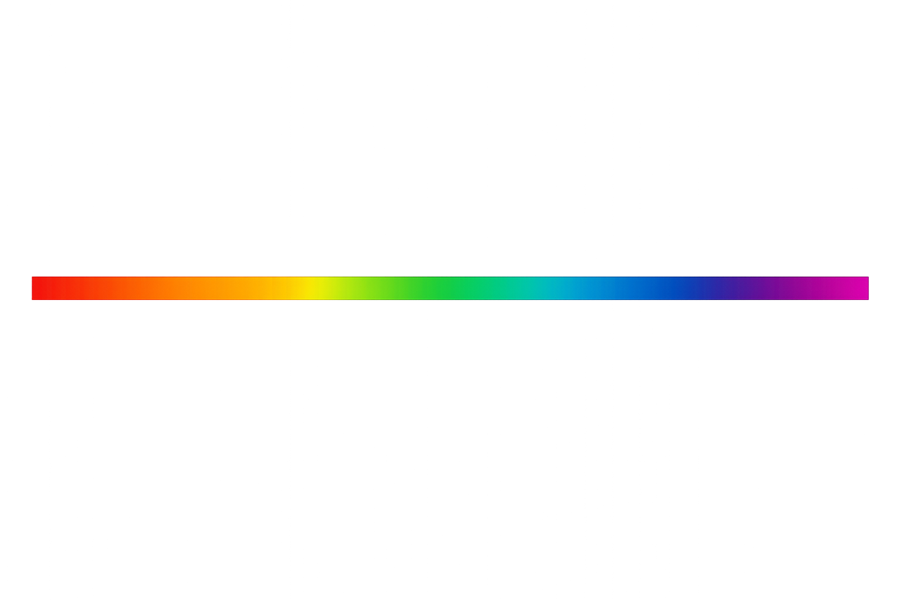
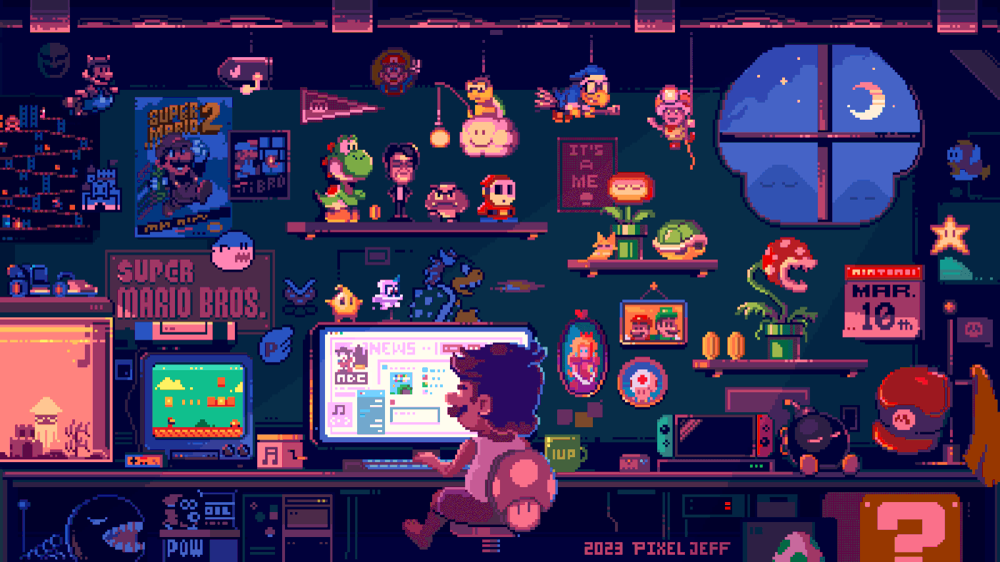

# 👩‍💻 Hello World, I'm Patrícia Gheller 👋

**`Desenvolvedora Full-Stack | Foco em Back-end com Python`**

#### Sobre mim

-  Olá, Meu nome é Patrícia Gheller e eu sou desenvolvedora, apaixonada por tecnologia, inovação e soluções criativas, sempre explorando novas ferramentas e aqui você encontra meus projetos, estatísticas e conquistas. 🚀

-  Atualmente curso **Análise e Desenvolvimento de Sistemas (ADS)** — já concluí 1 ano e 6 meses, tenho 1 ano restante.  
  Finalizei a formação **Full Stack pela Gama Academy - Hacker**, com especialização em **Front-end**,
  e alguns **Cursos Técnicos de informática** pela \*\*FAETEC - RJ.
- Natural do **Espírito Santo**, busco evoluir como desenvolvedora back-end em Python, sem deixar de lado o conhecimento em front-end para criar aplicações completas.

 

  

<h2 style="margin-top:-10px; border-bottom:none;">Linguagens e Tecnologias</h2>

  

  

<h2 style="margin-top:-10px; border-bottom:none;">Ferramentas da Minha Stack</h2>

  

<h2 style="margin-top:-10px; border-bottom:none;">Destaques do meu Github</h2>

<table>
    <thead>
        <tr>
            <th colspan="2" width="2000">&nbsp;</th>
        </tr>
    </thead>
    <tbody>
        <tr>
            <td align="right" valign="top" width="30"> 
                
            </td>
            <td valign="top">
                <h3>Meu Portfólio</h3>
                
Portfólio online para apresentar minhas habilidades, tecnologias que domino e projetos desenvolvidos.

               

    
  

            </td>
        </tr>
        <tr>
            <td align="center" valign="top" width="30"> 
                
            </td>
            <td valign="top">
                <h3>Desenvolvimento FullStack com Django</h3>
                
Criação de aplicativos web utilizando o poderoso framework Django.

                

                
                     

            </td>
        </tr>
        <tr>
            <td align="center" valign="top" width="30"> 
                
            </td>
            <td valign="top">
                <h3>Fast API</h3>
                
Projeto de estudo sobre FastAPI para construção de APIs RESTful assíncronas..

                

                  
                 

            </td>
        </tr>
        <tr>
  <td align="center" valign="top" width="25"> 
    
  </td>
  <td valign="top">
    <h3>Tradutor de Idiomas</h3>
    
Aplicação web que traduz textos entre múltiplos idiomas, com suporte a entrada por voz e leitura da tradução em voz alta. Desenvolvido com HTML, CSS e JavaScript.

    

    
    

  </td>
</tr>

</tbody>
</table>

<h2 style="margin-top:-10px; border-bottom:none;">📈 Estatísticas</h2> 

  

  

   

    
    
    
    
        

## 🏆 Conquistas

